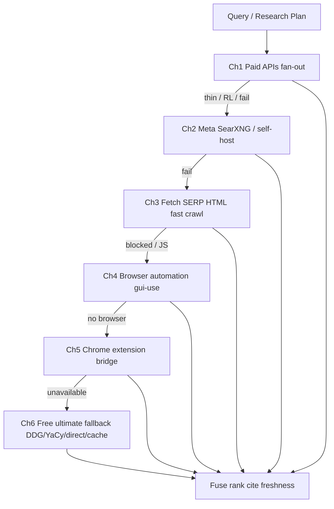

# Deep Research · Never-Halt · Ops Theatre

> 작성일: 2026-07-31  
> 지위: Sovereign Reform **부록 SSOT** — 웹/딥리서치 · 무인 복구 · 실시간 Ops TUI  
> 상위: [`2026-07-31-superliora-sovereign-reform.md`](./2026-07-31-superliora-sovereign-reform.md)  
> 코드 앵커:  
> - `packages/agent-core/src/tools/providers/research-search*.ts`  
> - `packages/agent-core/src/tools/providers/local-web-search*.ts`  
> - `packages/agent-core/src/tools/builtin/web/{web-search,fetch-url}.ts`  
> - `packages/gui-use` · Eyes / browser  
> - `packages/oauth` · provider-manager fallback  
> - `apps/liora/src/tui` · PREMIUM.md

---

## 0. 한 줄

> 검색은 **실패하지 않는다**. LLM/OAuth/API는 **멈추지 않는다**.  
> Goal/Fleet는 **무인으로 장기 병렬**한다.  
> 사람은 TUI **Ops Theatre**에서 한눈에 보고, 원할 때만 개입한다.  
> ADHD 친화: **도파민형 프리미엄 모션**으로 장기 작업이 지루하지 않다.

---

## 1. Deep Research Harness (개선 1순위)

### 1.1 현재 자산 (다시 만들지 말 것)

이미 있는 것:

| 자산 | 경로 | 사실 |
|---|---|---|
| `ResearchSearchEngine` | `research-search.ts` | auto/cascade, paid fan-out, free fallback, content budget |
| Adapters | `research-search-adapters.ts` | Brave · Tavily · Exa · Serper · SearXNG |
| Free local | `local-web-search.ts` | DDG HTML/Lite · intent · direct sources · cache · YaCy/SearXNG URL |
| Fusion | `research-search-fusion.ts` | rank/dedupe/escalate |
| Fetch | `local-fetch-url.ts` / `FetchURL` | SSRF 가드, JS-need 힌트 |
| Moonshot / xAI prefer | moonshot-web-search, xai-grok-build-web-providers | 벤더 검색 |

**갭 (개혁 대상):**

1. 브라우저 자동화 / Chrome 확장 채널 없음  
2. Google/Bing/공식 PSE 등 **주요 서비스 전면 통합** 미완 (Serper≈Google proxy만)  
3. Deep research = multi-hop 쿼리 플래너·인용·신선도 검증이 툴 계약에 약함  
4. “검색 실패 0” SLA / 채널 텔레메트리 부족  
5. TUI Settings에서 검색 스택 완전 편집 부족  
6. JS-heavy SERP에 대한 자동 browser escalate 미연결

### 1.2 제품 계약 — `WebSearch` / `DeepResearch`

공개 툴 (스키마 허리 유지):

| Tool | 역할 |
|---|---|
| `WebSearch` | 단일 쿼리 · 빠른 융합 결과 (Core 또는 Session) |
| `DeepResearch` | **멀티홉** 리서치 플랜 → 병렬 검색/크롤 → 인용 리포트 (Session/Extended; Fleet 워커가 실행) |
| `WebFetch` | URL 본문 (이미 FetchURL) — DeepResearch가 내부 호출 |

`DeepResearch` 입출력 초안:

```text
DeepResearch({
  question: string,
  freshness?: "any" | "day" | "week" | "month" | "year",
  depth?: "quick" | "standard" | "exhaustive",
  max_sources?: number,
  allow_browser?: boolean,   // escalate to browser channel
  budget_usd?: number,
})
→ {
  answer_outline: string,
  claims: [{ claim, sources[], confidence, as_of }],
  sources: [{ url, title, snippet, fetched_at, channel }],
  channels_used: string[],
  degraded: boolean,         // true if only free fallback survived
}
```

### 1.3 채널 스택 (수단·방법 — 실패 시 다음 채널)



**절대 규칙:** 모든 채널 실패해도 **빈 결과로 throw 하여 루프를 죽이지 않는다**.  
구조화 `degraded` 결과 + “다음 수동 개입 힌트”를 반환하고 Goal/Mission은 계속.

#### Channel 1 — Paid / Official Search APIs (통합 대상)

| Provider | 상태 | 비고 |
|---|---|---|
| Brave | 있음 | |
| Tavily | 있음 | |
| Exa | 있음 | |
| Serper (Google) | 있음 | |
| Google Custom Search / PSE | **추가** | API key |
| Bing Web Search (Azure) | **추가** | |
| You.com / Parallel / Perplexity API | **추가(옵트인)** | 약관·키 |
| Moonshot managed | 있음 | |
| xAI / Grok web | prefer 어댑터 있음 | 강화 |
| DuckDuckGo Instant Answer API | **추가** (무료 계층) | HTML과 병행 |

Settings → **Search**에서 키·가중치·RPM·enable.

#### Channel 2 — Meta / Self-host

- SearXNG (이미) — 다중 인스턴스 URL 풀 + health probe  
- YaCy (이미 URL) — P2P 폴백 강화  
- 사용자 제공 OpenSearch/메타 엔드포인트

#### Channel 3 — Fetch-based SERP / 초고속 크롤

- DDG HTML/Lite (이미) + **추가 SERP 템플릿**(약관 준수·UA 로테이션·레이트리밋)  
- 결과 URL에 대해 `FetchURL` 병렬 크롤 (기존 contentFetchLimit 상향 프로파일: deep)  
- HTML → readability/본문 추출 (OSS: mozilla readability 류 흡수)  
- `Cache` (이미 `LocalResearchCache`) TTL·키 정규화 강화  
- robots/ToS: 설정으로 polite mode 기본 on; aggressive는 명시 opt-in

#### Channel 4 — Browser automation

- `packages/gui-use` / Eyes: 검색 엔진 페이지 열기 → 결과 DOM 추출 → 링크 방문  
- JS 렌더 필수 페이지에서 Ch3 실패 시 **자동 escalate** (`allow_browser` 또는 depth=exhaustive)  
- 헤드리스 Chromium 번들 또는 시스템 Chrome  
- 캡차/로그인 벽: soft-fail → Ch5/Ch6, Goal은 중단 안 함

#### Channel 5 — Chrome extension bridge

- 로컬 native-messaging 또는 loopback bridge  
- 사용자가 로그인한 세션/쿠키로 **본인 브라우저 탭**에서 검색·스크랩 (명시 동의)  
- TUI: “Connect browser extension” 마법사  
- 보안: localhost only, token pairing, 범위 제한

#### Channel 6 — Ultimate free fallback (비용 $0, 필수)

우선순위 고정:

1. LocalResearchCache hit  
2. DuckDuckGo Lite/HTML  
3. DuckDuckGo IA API  
4. Direct sources (GitHub/npm/crates/arXiv… — 이미 intent 경로)  
5. YaCy / public SearXNG 미러 풀 (설정)  
6. 최후: **offline knowledge stub** — “네트워크 불가, 로컬 근거만으로 계속” 구조화 응답 (루프 생존)

`freeFallback` 기본 **강제 true** (끄려면 Settings에서 명시).

### 1.4 품질 · 신선도 · 정확도

| 메커니즘 | 설명 |
|---|---|
| **Query planner** | DeepResearch가 하위 쿼리 N개 생성 (모델 소형/저가 가능) |
| **Multi-provider fuse** | 기존 fusion 확장: channel weight + agreement score |
| **Freshness filter** | `as_of` / HTTP Date / 페이지 날짜 파싱; stale 강등 |
| **Citation gate** | 주장당 ≥1 URL; 없으면 claim을 speculative로 표기 |
| **Cross-check** | 상충 소스 시 Fleet mini-debate 또는 두 채널 재검색 |
| **Domain trust** | 공식 문서/RFC/벤더 docs 가중치 ↑; SEO 팜 ↓ |
| **Never empty** | 최소 1 결과 또는 degraded explanation |

### 1.5 KPI

| KPI | Target |
|---|---|
| WebSearch hard-fail rate (throw/empty killing turn) | **0%** |
| DeepResearch citation coverage | ≥ 95% claims cited |
| Freshness: `week` 요청 시 7일 이내 소스 비율 | ≥ 70% (주제에 따라) |
| Free-fallback-only sessions still return usable results | ≥ 99% |
| p95 WebSearch latency (quick, cache warm) | ≤ 2.5s |
| DeepResearch standard wall-clock | ≤ 45s typical |

### 1.6 Settings → Search (TUI 필수)

- Provider keys / enable / weight / RPM  
- Strategy: auto | cascade | parallel-all | free-only  
- Channels: fetch / browser / extension toggles  
- Free fallback force  
- Budgets: max paid calls, content pages, $  
- Health dashboard: last success per channel  
- Extension pairing  
- Polite vs aggressive crawl

### 1.7 OSS 흡수 (검색)

| OSS | 용도 |
|---|---|
| mozilla/readability 또는 @mozilla/readability | 본문 추출 |
| Cheerio / linkedom | HTML 파싱 (이미 유사 가능) |
| Playwright/Puppeteer (gui-use 정합) | Ch4 |
| SearXNG | Ch2 |
| Firecrawl / similar (옵트인 API) | 크롤 SaaS 슬롯 |
| OpenCode/Hermes webfetch 패턴 | 에러 ACI |

---

## 2. Never-Halt Resilience (무인 장기 Goal)

### 2.1 헌법 — P-NeverHalt

> OAuth 만료 · API 429 · 모델 5xx · 검색 실패 · MCP 죽음 · 네트워크 순단 ·  
> 권한 모호 · 워커 크래시 → **Goal/Mission/Fleet를 죽이지 않는다**.  
> 자동 대응 → 저하 모드 → 재시도 → 대체 경로 → 사람에게 **비차단 알림**.

사람이 자리를 비워도:

- Goal 루프는 soft-degrade로 전진 가능한 일을 계속  
- 차단형 승인만 큐에 쌓고, **다른 브랜치/워커는 진행**  
- 재개 시 큐·ledger·git 상태에서 정확히 이어감

### 2.2 장애 분류와 자동 대응

| 클래스 | 예시 | 자동 대응 |
|---|---|---|
| **Auth** | OAuth expire, 401 | silent refresh → 계정 풀 rotate → 다음 provider → 큐에 `auth_needed` (비차단) |
| **Rate** | 429, RPM | exponential backoff + jitter · cooldown slot · 다른 키/모델 |
| **Provider down** | 5xx, timeout | model-fallback 체인 · 라우팅 역할별 대체 |
| **Tool fail** | search/mcp/bash | 채널/툴 대체 · degraded result · 재계획 |
| **Permission** | ask mode | 저위험 auto 정책(설정) · 고위험만 큐; Fleet 다른 파일 계속 |
| **Worker death** | subagent crash | restaff · DAG 재스케줄 · lease 해제 |
| **Context full** | context limit | structured compaction · Mission artifact flush · 계속 |
| **Budget** | $ / token cap | Cost Guard soft-stop · 요약 후 pause (kill 아님) |
| **Network** | offline | free/cache/local index only · offline banner |

### 2.3 LLM 호출 경로

`provider-manager` 강화:

1. `fallbackModels` 필수 운영 기본값 권장 (Settings)  
2. 재시도 가능 오류 vs fatal 분류 표 단일화  
3. **Circuit breaker** per provider — 열린 동안 트래픽 우회  
4. 스트리밍 중단 → partial commit + retry continuation 정책  
5. 모든 실패 → protocol event `runtime.degraded` (TUI Ops가 구독)

### 2.4 OAuth / Accounts

- `packages/oauth` + TUI Accounts: proactive refresh (만료 N분 전)  
- Multi-account pool: sticky → failover  
- Refresh 실패: Goal 유지, `auth_needed` 배지, **다른 계정/키로 가능한 작업 계속**  
- API key invalid: 즉시 다음 credential; 전멸 시에만 pause

### 2.5 Goal / Mission / Fleet 계약

```text
onFailure(error):
  classify → recover() → if recoverable: continue
  else: enqueue HumanInterrupt(non_blocking) + degrade_branch
  never: throw out of goal-loop uncaught
```

- `goal-loop.ts` / mission run-store: **uncaught = bug** (테스트 게이트)  
- Parallel: 한 워커 실패 ≠ 플릿 실패  
- Evidence gate: 검색 degraded여도 로컬 검증(L1/L2)로 진행 가능하면 진행

### 2.6 KPI

| KPI | Target |
|---|---|
| Unattended Goal hard-stop (no human) from transient faults | **0** |
| OAuth refresh success before expiry | ≥ 99% |
| Provider 429 → successful alternate within 60s | ≥ 95% |
| Mean time to auto-recover (MTTR auto) | ≤ 30s typical |

---

## 3. Ops Theatre TUI — 한눈 모니터 + 즉시 개입

### 3.1 한 화면 정보 구조 (필수)

분할(프리셋 `/ops` 또는 Mission/Fleet 실행 시 자동):

```text
┌─ Fleet / Agents ──────────┬─ Goal / Mission ──────────────┐
│ worker cards · state · $  │ objective · phase · evidence  │
│ stream spark · errors     │ budget · ETA · interrupts     │
├─ Git / Workspace ─────────┼─ Runtime Health ──────────────┤
│ branch · dirty · live diff│ cache% · search channels ·    │
│ per-file churn heatmap    │ oauth · provider · index      │
└───────────────────────────┴───────────────────────────────┘
                    ▼ Intervention tray (sticky)
              approve / steer / pause / focus / retry
```

데이터 소스:

- Agent/Fleet events (기존 swarm UI 확장)  
- Goal/Mission ledger  
- `git status` + streaming diff (kaos/git · Watch)  
- Usage/cache/search health  
- HumanInterrupt queue

### 3.2 즉시 개입 액션

| 액션 | 키/클릭 | 효과 |
|---|---|---|
| Approve / Deny | tray | 권한 큐 처리 |
| Steer worker | | 지시 주입 |
| Pause / Resume Mission | | soft pause |
| Focus agent | | 해당 스트림 확대 |
| Retry channel | | 검색/프로바이더 즉시 재시도 |
| Open diff | | 파일 단위 diff 뷰 |
| Kill worker | | lease 반환 + restaff |

### 3.3 ADHD · 도파민 PREMIUM (공격적)

원칙: **가독성·정보 밀도 먼저**, 그 위에 **보상형 모션**.  
`PREMIUM.md` 확장 섹션 **§ Dopamine Ops** (별도 PR로 규범화).

| 효과 | 트리거 | 제약 |
|---|---|---|
| Goal XP / progress pulse | evidence pass, todo done | 150–400ms; quality level 따름 |
| Fleet card flourish | worker complete | batch invalidation ≤8ms/frame |
| Cache hit streak counter | warm hit | footer spark |
| Search channel cascade viz | DeepResearch | 채널 점등 애니메이션 |
| Diff rain / churn sparks | git write bursts | subtle→full |
| Combo / streak | N checks green | 과하지 않게 숫자+모션 |
| Critical interrupt flash | auth/budget | 접근성: NO_COLOR/SSH off |
| Idle ambient | long wait | 기존 idle-scene 강화 |

품질 레벨:

- `off` — 정보만 (CI/SSH)  
- `subtle` — 상태 전이 모션  
- `full` — 도파민 풀 (기본 인터랙티브 로컬)  
- Settings → **Visual Quality** (구 Premium Quality와 분리된 작업 품질)

가독성 하드룰:

- 상태 색: success/warn/error/info 토큰만  
- 한 카드 = 한 워커/한 Goal  
- 스크롤 없이도 “빨간 개입 필요”가 보임 (interrupt tray sticky)

### 3.4 구현 경로

| 영역 | 경로 |
|---|---|
| Layout preset | `apps/liora/src/tui/features/ops-theatre/` (신규) |
| Git live | `features/` + kaos git watch · transcript diff reuse |
| Fleet cards | 기존 `features/agent-swarm` 리네임/확장 |
| Motion | `features/appearance/appearance-effects.ts` + PREMIUM |
| Events | protocol: `ops.*` / reuse mission/fleet/usage |

---

## 4. Workstreams (본 부록)

### W-DR1 — Search channel matrix (2–3주) — **최우선**

- Google PSE · Bing · DDG IA 어댑터  
- Channel health + never-empty  
- Settings → Search  
- **Done:** free-only 모드 벤치 green; hard-fail 0

### W-DR2 — DeepResearch tool + planner (2–3주)

- 툴 스키마 · multi-hop · citations · freshness  
- fusion 고도화  
- **Done:** citation ≥95% on gold set

### W-DR3 — Fetch crawl + readability (2주)

- 병렬 fetch · readability 흡수 · cache  
- **Done:** content quality eval

### W-DR4 — Browser + Extension channels (3–4주)

- gui-use search recipes  
- Chrome extension bridge + TUI pair  
- auto-escalate from Ch3  
- **Done:** JS SERP 성공률 목표

### W-NH1 — Never-Halt runtime (3주)

- error taxonomy · circuit breaker · OAuth proactive  
- goal-loop uncaught=0 tests  
- degraded events  
- **Done:** chaos suite (kill oauth mid-goal) survives

### W-NH2 — Permission non-blocking queue (2주)

- 고위험만 블록; 저위험 정책; 병렬 진행  
- **Done:** ask-mode에서도 Fleet 타 브랜치 진행

### W-OPS1 — Ops Theatre layout (3주)

- 4-pane monitor · intervention tray  
- live git diff  
- **Done:** 한 화면 감사 체크리스트

### W-OPS2 — Dopamine PREMIUM pack (2–3주)

- PREMIUM § Dopamine Ops  
- streak/XP/channel viz  
- quality levels  
- **Done:** visual smoke + frame budget

---

## 5. 패키지 충격

| 패키지 | 변경 |
|---|---|
| `agent-core` tools/providers | 채널·DeepResearch·never-empty |
| `agent-core` goal/mission/fleet | never-halt · degrade |
| `agent-core` session/provider | circuit breaker · fallback |
| `oauth` | proactive refresh · pool |
| `gui-use` | search automation recipes |
| `apps/liora` | Search settings · Ops Theatre · motion |
| `protocol` | ops/degraded/search-channel events |
| 신규 `apps/liora-browser-bridge` 또는 extension/ | Ch5 |
| `docs` | Search/Ops 사용자 문서 (추후 gen-docs) |

---

## 6. 보안 · 약관 · 윤리 (검색)

- SSRF 가드 유지 (`local-fetch-url`)  
- Extension = 사용자 동의·로컬 전용  
- Aggressive crawl = opt-in  
- 검색 결과에 대한 prompt-injection 센서 (HTML/주석 지침 무시 리마인더)  
- 시크릿 레드액션 (페이지 내 키 패턴)

---

## 7. 의사결정

1. 웹/딥리서치는 Sovereign 우선순위 **공동 1순위(개선)** — Orchestration과 병행하되 검색 실패는 제품 결함.  
2. 무료 최종 폴백 **필수·기본 on**.  
3. 검색/LLM/OAuth 실패는 Goal을 죽이지 않음.  
4. Ops Theatre = 기본 장기작업 UX.  
5. 도파민 모션 = Visual Quality full에서 공격적, off에서 정보만.

---

## 8. 즉시 컷 (구현 시)

1. Channel health + never-empty wrapper around `ResearchSearchEngine`  
2. Settings → Search 골격  
3. `runtime.degraded` 이벤트 + footer 배지  
4. Ops Theatre 와이어프레임 (4-pane)  
5. Chaos test: 429 mid-goal → fallback model continues

---

## 9. Extensibility (Skills · Plugins · MCP)

Claude Code 호환 + TUI 즉시 관리 — Sovereign Reform §19 / **W16**.

- MCP Manage: toggle · install (stdio/http/sse) · remove · hot-reload from disk  
- Skills Manage: enable/disable · install path · remove · `.claude/skills` scan  
- Plugins: 기존 `/plugins`를 Settings → Extensions에서 1클릭  
- 설치 실패는 Goal을 죽이지 않음 (Never-Halt); `runtime.degraded` + Ops tray

### W-EXT1 (즉시)

MCP file mutate + reload RPC + TUI panel · Skills disabled state · Settings Extensions hub

