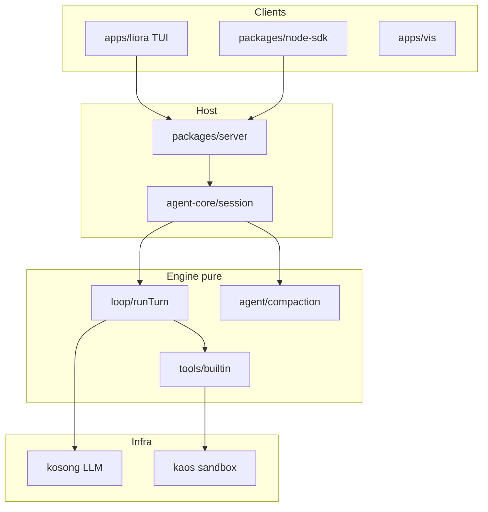
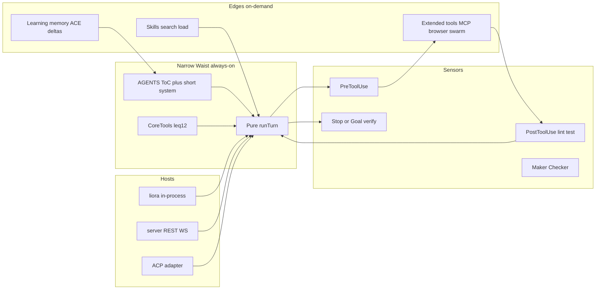

# SuperLiora SOTA Harness 재설계 계획

> 작성일: 2026-07-31  
> **지위: 기술 부록.** 제품 우선순위·debrand·캐시 99%·RepoIndex·Fleet/Mission·Settings 완전성은  
> [`2026-07-31-superliora-sovereign-reform.md`](./2026-07-31-superliora-sovereign-reform.md) 가 SSOT. 충돌 시 Sovereign Reform 우선.  
> 성격: **구현 로드맵 / 아키텍처 의사결정** (제품 마케팅 문서 아님)  
> 근거:  
> - 내부 연구: [`docs/research/coding-agent-harness-2026/`](../research/coding-agent-harness-2026/)  
> - 기존 스펙: [`2026-07-12-superliora-harness-minimization-roadmap.md`](./2026-07-12-superliora-harness-minimization-roadmap.md)  
> - OSS 소스 교차분석 (로컬 클론: `.superliora/harness-research/`):  
>   - [anomalyco/opencode](https://github.com/anomalyco/opencode)  
>   - [xai-org/grok-build](https://github.com/xai-org/grok-build)  
>   - [NousResearch/hermes-agent](https://github.com/NousResearch/hermes-agent)  
>   - [OpenHands/OpenHands](https://github.com/OpenHands/OpenHands) (현 Agent Canvas / ACP 허브)  
> - 벤더 공식: Anthropic / OpenAI / Google / Cursor / z.ai / DeepSeek ([10-vendor](../research/coding-agent-harness-2026/10-vendor-official-harness.md))

---

## 0. 목표와 비목표

### 목표

SuperLiora를 **TUI 우선 코딩 에이전트 하네스**로서, 모델이 바뀌어도 버티는 **운영 환경(SOTA harness)** 으로 만든다.

성공 정의 (측정 가능):

| KPI | 목표 |
|---|---|
| Default always-on tool count | ≤ 12 (현재 agent.yaml ~40+ 스키마 항목) |
| Cold-start always-on guide tokens | AGENTS/system 합 ≤ ~3–4k 지침 토큰 (상세는 on-demand) |
| Post-edit sensor loop | Edit/Write 후 lint/type/test 자동 피드백 (옵트인→기본) |
| Long-run resume | feature/progress/handoff 아티팩트로 세션 재시작 성공률 ≥ 수동 대비 |
| Local latency | 인프로세스 경로 TTFT < 서버 경로 (p50) |
| Regression ratchet | `check:test-baseline` + smoke 유지; 신규 실패 0 |

### 비목표

- 가중치 self-train / DGM식 프로덕션 self-mod (연구 샌드박스만)
- 서버 모드 폐기, TUI 폐기
- OpenCode/Grok를 그대로 포팅 (언어·제품 경계 유지)
- Skill 카탈로그 전체 삭제 (게이트·검색으로 해결)

### 제품 포지션 (고정)

> SuperLiora = **Sensors + Observability가 1급인 TUI 코딩 하네스**.  
> 모델은 교체 가능하고, harness(루프·툴·권한·컴팩션·검증·실시간 가시성)가 복리로 쌓인다.

---

## 1. 현재 상태 진단 (코드 팩트)

### 1.1 아키텍처 (유지할 강점)

**지켜야 할 하드 제약** ([`AGENTS.md`](../../AGENTS.md), [`packages/agent-core/AGENTS.md`](../../packages/agent-core/AGENTS.md)):

1. `Agent` standalone (Session 없이 생성)
2. `apps/liora` → `@superliora/sdk` only (agent-core 직접 import 금지)
3. `src/loop` host-free (session/RPC/UI import 금지)
4. Event-side truncation (모든 클라이언트 공유)
5. Source-install commit atomicity
6. `check:test-baseline` ratchet

### 1.2 치명적 갭 (경쟁·이론 대비)

| # | 갭 | 증거 | SOTA 기준 |
|---|---|---|---|
| G1 | **Default tool waist가 너무 넓음** | [`agent.yaml`](../../packages/agent-core/src/profile/default/agent.yaml)에 Read…UltraSwarm·GenerateVideo·mcp__*까지 always-on | Hermes: core narrow + check_fn 게이트; OpenCode: ~15 core tools |
| G2 | **Skill catalog 비대** | `skill/catalog`에 수천 파일급 커뮤니티 스킬 | Grok tool search / Hermes skills_list; progressive disclosure |
| G3 | **로컬이 서버 경유** | `apps/liora` → `@superliora/server` | OpenCode/Grok/Hermes: 프로세스 내 루프가 기본 |
| G4 | **apply_patch 부재(기본)** | Edit old/new만 | OpenCode `apply_patch.ts` 1급 |
| G5 | **컴팩션이 구조화 handoff 약함** | micro-compaction 존재하나 Anthropic/OpenCode식 Objective/WorkState/Next 템플릿 약함 | OpenCode SUMMARY_TEMPLATE; Anthropic feature JSON |
| G6 | **PostToolUse sensor 기본 루프 약함** | hooks 인프라 있으나 품질 루프가 제품 기본이 아님 | OpenAI harness eng.; Claude Stop hook /goal |
| G7 | **Instruction vs Learning memory 미분리** | Memory 툴 단일 | z.ai / ACE / Hermes auto memory |
| G8 | **Tool discovery 부족** | SearchTools 있으나 MCP/스킬 폭발 시 BM25급 인덱스 약함 | Grok `ToolSearchIndex` |
| G9 | **Long-run 제품화 미완** | goal/ultraplan/swarm은 있으나 initializer+coding+clean-state 프로토콜 미정착 | Anthropic long-running; Ralph/`/goal` |
| G10 | **Maker≠Checker 기본화 부족** | LioraReview 존재하나 stop-gate로 강제되지 않음 | Anthropic evaluator; RQGM 교훈 |

### 1.3 이미 있는 자산 (다시 만들지 말 것)

- Pure loop + guards ([`loop/run-turn.ts`](../../packages/agent-core/src/loop/run-turn.ts))
- Permission policies + plan-mode deny
- Micro-compaction + experimental flags
- HookEngine + Claude hooks adapter
- Plan / Goal / UltraSwarm / RunProjectChecks
- Nested AGENTS.md + skills progressive load 경로
- TUI live stream + emitter truncation
- kaos sandbox, kosong provider routing

---

## 2. OSS 교차분석 — Steal / Avoid

### 2.1 OpenCode (`anomalyco/opencode`)

| Steal | Avoid |
|---|---|
| **Core tool 세트** 최소화: read/edit/write/grep/glob/shell/`apply_patch`/todo/plan/skill/task/question/webfetch/websearch/(lsp) | Effect 전면 이식 (우리 DI/loop 유지) |
| **Structured compaction** (`Objective / Work State / Next Move / Relevant Files`) | Context Epoch 용어 전체 도입 전 과설계 |
| `tool.execute.before` + Truncate 서비스 | 패키지 폭증(enterprise/console…) 복제 |
| Plan enter/exit 에이전트 전환 UX | Bun 전용 런타임 강제 |

핵심 경로: `packages/opencode/src/tool/*`, `packages/core/src/session/compaction.ts`, `CONTEXT.md`.

### 2.2 Grok Build (`xai-org/grok-build`)

| Steal | Avoid |
|---|---|
| **Skills / hooks / plugins / MCP / subagents / memory / sandbox / worktrees / ACP** 1급 모듈화 | Rust 재작성 |
| `ToolSearchIndex` (BM25, hidden tools, server summaries) | 과도한 connector 게이트웨이 |
| Memory: archive/search/dream 분리 사고 | Embedding 의존을 기본 경로로 강제 |
| Headless + ACP (이미 `@superliora` ACP와 정렬) | 바이너리 배포 모델 복제 |
| docs/tutorial 수준의 사용자 하네스 교육 | |

핵심 경로: `xai-grok-agent`, `xai-grok-tools`, `xai-grok-hooks`, `xai-grok-memory`, `xai-grok-shell`.

### 2.3 Hermes Agent (`NousResearch/hermes-agent`)

| Steal | Avoid |
|---|---|
| **Prompt-cache sacred** — mid-turn toolset/system swap 금지 | 메신저 게이트웨이 전부 |
| **Narrow waist + toolsets + check_fn** | `_HERMES_CORE_TOOLS`에 GUI/video까지 실은 모순 — 원칙만 채택 |
| Skill self-improve / session_search / trajectory compress (연구·오프라인) | 프로덕션 자동 skill_manage without human gate |
| Multi terminal backends 사고 (local/docker/ssh) | 7백엔드 즉시 전부 |

핵심: `AGENTS.md` (cache + waist), `toolsets.py`, `run_agent.py`, `trajectory_compressor.py`.

### 2.4 OpenHands (현 Agent Canvas)

| Steal | Avoid |
|---|---|
| **ACP 멀티 에이전트 컨트롤 센터** 사고 (우리 ACP와 정합) | Canvas UI 복제 |
| Backend registry (local/remote/cloud 전환) | PostHog/텔레메트리 복제 |
| Skills catalog 패키지 분리 (`@openhands/extensions`) | 에이전트 런타임이 프론트에 섞인 구조 |

참고: 레포는 에이전트 코어가 아니라 **오케스트레이션 UI**. CodeAct 코어는 SDK/서버 쪽으로 이전됨 → “멀티 하네스 호스트” 패턴만 참고.

### 2.5 벤더 공식 합의 (재확인)

Anthropic ACI · OpenAI AGENTS-as-ToC + mechanical lint · Google harness impermanence · Cursor Rules/Skills · z.ai Goal/Context/Constraints/Done · DeepSeek cache/thinking levers.

---

## 3. 목표 아키텍처 (To-Be)

### 3.1 Tool layers

| Layer | Tools (안) | 로드 |
|---|---|---|
| **Core** | Read, Write, Edit, ApplyPatch, Grep, Glob, Bash, RunProjectChecks, TodoList, Enter/ExitPlanMode, AskUserQuestion, WebSearch *또는* FetchURL 중 기본 1–2 | always |
| **Session** | Memory(instruction 분리 후), Skill/SearchSkill, Agent(subagent), Task* | default on, 스키마 비용 관리 |
| **Extended** | UltraSwarm, Browser, Computer, Context7*, Generate*, Liora*, VerifySurface, mcp__* | 플래그/프로필/검색으로 opt-in |
| **Hidden** | 위험·희소 MCP | ToolSearchIndex로만 노출 |

### 3.2 Context layers

| Layer | 내용 | 규칙 |
|---|---|---|
| Instruction | nested AGENTS, system layers | 사람 SSOT, CI로 freshness |
| Learning | ACE식 delta bullets / auto memory | provenance, prune, helpful/harmful |
| Episode | session history + structured compaction | OpenCode 템플릿 |
| Artifacts | PLAN.md, progress, feature JSON | long-run write-out |

### 3.3 Host layers

| Host | 역할 |
|---|---|
| **In-process (신규 기본 로컬)** | liora → sdk → agent-core (서버 없이) |
| Server | 팀/원격/vis |
| ACP | IDE/외부 오케스트레이터 |

---

## 4. 작업 스트림 (Phases)

### Phase A — Waist 축소 (P0, 1–2주)

**목표:** 매 턴 토큰·툴 선택 혼동을 즉시 줄인다.

1. **Default profile 재분할**
   - `agent` = Core+Session만
   - `superliora-full` / 플래그 = Extended
   - [`agent.yaml`](../../packages/agent-core/src/profile/default/agent.yaml)에서 UltraSwarm·Generate*·VerifySurface·다수의 Liora*·무분별 `mcp__*` 제거 또는 게이트
2. **Skill catalog 게이트**
   - always-on description만 인덱스; 본문 on-demand (이미 방향 있음 → **강제**)
   - risk/source 필터; 기본 배포 카탈로그 축소 또는 “official + user” 분리
3. **ApplyPatch 도구 추가** (OpenCode 패턴)
   - Edit과 공존; 멀티파일 수정 경로
4. **ACI 패스**
   - 절대경로 강제, 툴 description 중복 제거, 에러 메시지에 remediation (OpenAI lint 메시지 패턴)

완료 게이트: 기본 프로필 툴 ≤12–15, smoke+baseline green, 시나리오 3종(버그/피처/리팩터).

### Phase B — Sensors 제품화 (P0–P1, 1–2주)

1. PostToolUse: Edit/Write → `RunProjectChecks` 또는 scoped lint/type (설정 가능)
2. Stop / Goal: 검증 명령 green 전 종료 차단 (`stop_hook_active`식 루프 가드)
3. PreToolUse: 파괴적 shell / `.env` (이미 일부 정책 → 기본 on)
4. Optional Maker≠Checker: `LioraReview`를 goal 완료 경로에 연결 (동일 세션 자기채점 금지 옵션)

완료 게이트: “테스트 실패인데 done 선언” 재현 케이스 차단.

### Phase C — Context / Compaction / Long-run (P1, 2–3주)

1. **Structured compaction** 템플릿 도입 (OpenCode SUMMARY_TEMPLATE 차용, 우리 이벤트 스키마에 맞게)
2. **Long-run protocol** (Anthropic):
   - Initializer 스킬/모드: `init` + `feature_list.json` + `progress.md`
   - Coding 세션: 1 feature / clean git state
3. **Instruction vs Learning memory** 분리 (파일 경로·툴 파라미터)
4. ACE-lite Curator: 실패→delta bullet 제안 → 사람 승인 후 AGENTS/memory 반영 (자동 append 금지가 기본)

완료 게이트: 컨텍스트 리셋 후 handoff만으로 작업 재개 E2E.

### Phase D — In-process Host (P1, 1–2주)

1. `apps/liora` 로컬 기본 경로: server 없이 sdk→agent-core (최소화 로드맵 Phase 2)
2. 서버는 `--server` / 원격 전용
3. CLI 로그 모드 유지 + TUI 기본은 유지하되 **디커플** (TUI 없이도 루프 완주)

완료 게이트: `liora` 로컬 TTFT/디버그 경로 문서화 + smoke.

### Phase E — Discovery & Edges (P2, 2주)

1. Grok식 **ToolSearchIndex** (스킬+MCP+extended tools)
2. Worktree isolation UX (swarm/subagent와 정렬)
3. ACP/외부 오케스트레이터와의 “many hands” 인터페이스 정리 (Anthropic Managed Agents 교훈: brain≠hands)
4. Provider cache/thinking 레버를 루프에 명시 (DeepSeek/GLM 교훈)

### Phase F — Self-improve (P2–P3, 연구→제품)

프로덕션 기본: **P0–P3 of self-improve ladder** ([09](../research/coding-agent-harness-2026/09-self-improving-agents.md))

1. Human ratchet (이미) + doc/lint CI
2. Trace→Skill 제안 파이프라인 (사람 merge)
3. Offline DGM-lite / ADAS 실험은 샌드박스 레포만
4. Memory provenance + zombie/poisoning 방어

---

## 5. 제거 / 동결 / 추가 목록

### 제거 또는 기본 off

| 항목 | 조치 |
|---|---|
| Default의 UltraSwarm / GenerateVideo / 광범위 mcp__* | Extended로 이동 |
| 중복 Liora*가 Core Read/Grep와 겹치면 | 머지 또는 Extended |
| Aspirational AGENTS 조항 | Hashimoto ratchet: 실패 근거 없는 줄 삭제 |
| 서버 필수 가정 | 로컬 기본에서 제거 |

### 동결 (당분간 기능 추가 금지)

| 영역 | 이유 |
|---|---|
| 신규 기본 프로필 증식 | 적응형 툴 로드로 대체 |
| 프로덕션 self-mod agent-core | 안전 |
| Skill catalog 무제한 ingest | waist 파괴 |

### 추가

| 항목 | 출처 |
|---|---|
| ApplyPatch | OpenCode |
| Structured compaction | OpenCode / Anthropic |
| Long-run initializer protocol | Anthropic |
| ToolSearchIndex | Grok |
| PostToolUse quality loop | OpenAI / Claude BP |
| In-process host | OpenCode/Hermes/최소화 로드맵 |
| Instruction/Learning memory split | z.ai / ACE / Hermes |
| Stop/Goal verification gate | Claude `/goal` / Stop hook |

---

## 6. 패키지별 변경 지도

| 패키지 | 변경 |
|---|---|
| `packages/agent-core` | profile waist, ApplyPatch, compaction template, memory split, tool index, sensors hooks |
| `packages/node-sdk` | 인프로세스 진입점 공개 API 정리 |
| `packages/server` | 선택 호스트로 격하(기능 유지) |
| `apps/liora` | 기본 인프로세스; TUI는 관측층 유지 |
| `packages/kaos` | sandbox policy 기본값 강화 |
| `packages/acp-adapter` | many-hands 정렬 |
| `packages/tui-renderer` | truncation/stream만; 루프 로직 금지 유지 |
| `.agents/skills` + catalog | 검색·게이트; Trace→Skill 제안 스킬 |
| root `AGENTS.md` | ToC화 (OpenAI); 상세는 nested |

---

## 7. 검증 계획

| 레벨 | 방법 |
|---|---|
| L1 | unit: loop guards, ApplyPatch, compaction template, tool schema size |
| L2 | `pnpm -C apps/liora run smoke`, `check:imports`, `build:dts` |
| L3 | 시나리오: bugfix / feature / multi-file refactor / long-run resume |
| L4 | 경쟁 벤치(선택): Terminal-Bench / SWE subset — **하네스만 바꾼 A/B** |
| Safety | memory poison red-team; PreToolUse; sandbox egress |

Source-install gate 필수 ([AGENTS.md](../../AGENTS.md)).

---

## 8. 리스크와 원칙

1. **Harness impermanence** (Google/Anthropic): Opus급 모델이 세면 scaffolding을 걷는다. 매 분기 “죽은 하네스” 감사.
2. **Prompt-cache sacred** (Hermes): 턴 중 toolset/system 스왑 금지.
3. **Waist vs edges**: 제품 기능 확장은 edges; core schema는 보수적.
4. **기계적 강제 > prose** (OpenAI): 문장으로 막는 것은 훅/린트로 승격.
5. **TUI는 센서의 인간측**: 실시간 가시성은 차별점 — 루프에 넣지 말고 emitter에 유지.
6. **잘못된 OSS 주소 주의**: OpenCode=`anomalyco/opencode`, Grok Build=`xai-org/grok-build` (커뮤니티 래퍼/프롬프트 레포와 혼동 금지).

---

## 9. 실행 순서 (권장 스프린트)

| Sprint | 산출물 |
|---|---|
| S1 | Phase A: waist + ApplyPatch + ACI |
| S2 | Phase B: PostToolUse + Stop/Goal gates |
| S3 | Phase D: in-process local path |
| S4 | Phase C: structured compaction + long-run protocol |
| S5 | Phase E: ToolSearchIndex + extended opt-in UX |
| S6 | Phase F: Trace→Skill + memory provenance |

각 스프린트마다 changeset + baseline/smoke.

---

## 10. 의사결정 로그 (이 문서에서 확정)

1. **로컬 기본 = 인프로세스**, 서버는 옵션 (최소화 로드맵과 동일, 강화).
2. **TUI 유지**, 루프 필수 의존은 제거.
3. **Edit + ApplyPatch 병행**, Core에 둘 다.
4. **Self-mod L3+는 샌드박스만**; 제품은 L0–L2 + human ratchet.
5. **OpenHands는 ACP 호스트 패턴만** 참고 (Agent Canvas ≠ agent core).
6. **Hermes의 “cache + waist” 원칙을 채택**, core tool 목록은 그대로 복사하지 않음.

---

## 11. 다음 액션 (구현 착수 시)

1. `agent.yaml` waist PR (가장 높은 ROI)
2. ApplyPatch 설계 노트 + 스키마
3. Structured compaction 템플릿 초안을 `agent/compaction`에 연결
4. `apps/liora` in-process spike 브랜치
5. 본 스펙을 [`docs/research/.../README.md`](../research/coding-agent-harness-2026/README.md)에서 링크

연구 클론 위치: `.superliora/harness-research/{opencode,grok-build,hermes-agent,OpenHands}` — gitignored 권장.
