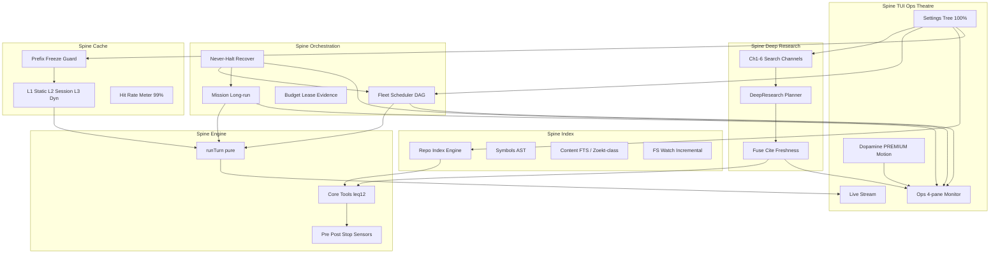

# SuperLiora Sovereign Harness Reform

> **Master program charter** — 2026-07-31  
> 성격: 구현용 **방대·구체 계획** (제품 마케팅 아님).  
> 지위: 본 문서가 하네스 개혁의 **SSOT**. 이전 문서  
> [`2026-07-31-sota-harness-redesign.md`](./2026-07-31-sota-harness-redesign.md) ·  
> [`2026-07-12-superliora-harness-minimization-roadmap.md`](./2026-07-12-superliora-harness-minimization-roadmap.md) 는 **하위 기술 부록**으로 흡수한다.  
> 연구 근거: [`docs/research/coding-agent-harness-2026/`](../research/coding-agent-harness-2026/) · OSS 클론 `.superliora/harness-research/`.

---

## 0. North Star

### 0.1 한 줄

> SuperLiora는 **딥리서치(검색 실패 0)·오케스트레이션·초고속 비동기 병렬·무인 Never-Halt·Ops Theatre TUI·보안·프롬프트 캐시·토큰/비용 효율**을 최우선으로 하는  
> **Terminal-Bench 검증 가능한 SOTA 코딩 에이전트 하네스**다.  
> 브랜딩 장난(`ultra*` / `liora*` 툴명 / Ultrawork 워크플로)은 폐기하고, **기능의 힘**으로만 이긴다.  
> 상세 부록: [`2026-07-31-deep-research-never-halt-ops-tui.md`](./2026-07-31-deep-research-never-halt-ops-tui.md).

### 0.2 제품 우선순위 (고정, 충돌 시 상위가 이김)

| 순위 | 축 | 의미 |
|---:|---|---|
| 1a | **Deep Research / Web** | 주요 검색 전면 통합 · 무료 최종 폴백 · 브라우저/확장 · 실패율 0 |
| 1b | **Orchestration** | 다인 에이전트·DAG·예산·증거 게이트가 1급 |
| 2 | **Never-Halt + Async parallel** | OAuth/API/LLM/검색 장애에도 Goal 생존 · 워커 병렬 |
| 3 | **Ops Theatre TUI** | 에이전트·Goal·git diff·헬스 한눈 모니터 + 즉시 개입 + 도파민 모션 |
| 4 | **Security** | 권한·샌드박스·시크릿·프롬프트 인젝션 센서 |
| 5 | **Cache hit ≥ 99%** | prefix 안정 + mid-turn 불변 + provider 레버 |
| 6 | **Token / $ efficiency** | 좁은 툴 허리 · 인덱스 우선 탐색 · 구조화 컴팩션 |
| 7 | **Bench quality** | Terminal-Bench / 검색·무인 chaos / 내부 시나리오 |

### 0.3 성공 KPI (숫자로만 선언)

| KPI | 현재(대략) | Target | 측정 |
|---|---|---|---|
| Prompt-cache hit rate (세션 누적, 안정 prefix 구간) | 가변 / 종종 ≪99% | **≥ 99%** (warm turns) | `UsageStatus.cacheHitRate` + provider usage |
| Default always-on tool schemas | ~35+ + `mcp__*` | **≤ 12** (Core) | profile schema dump |
| Repo search p95 (indexed, warm) | rg cold 매번 | **≤ 50ms** symbol · ≤ 150ms content | Index bench |
| Parallel tool-call fanout | 부분 | 독립 콜 **완전 병렬** + 결과 배리어 | loop telemetry |
| Swarm/fleet wall-clock vs serial | Ultra* 브랜딩 혼재 | 동일 작업 **≥ 2.5×** 단축 (N=4 workers) | swarm ledger |
| $/solved task (내부 suite) | 미정 | 베이스라인 대비 **−40%** | cost ledger |
| Terminal-Bench (공개 또는 내부 포크) | 미정 | 분기별 **상위권 / 전년 대비 +Δ** | CI nightly |
| Settings coverage | 부분 | 운영 설정 **TUI 100%** (CLI-only 예외 문서화) | settings inventory audit |
| Branding debt | Ultra*/Liora*/uw 전역 | **공개 표면 0** | ripgrep gate |
| WebSearch hard-fail (turn-killing) | 미계측 | **0%** | search telemetry |
| Free-fallback usable result rate | 부분 | **≥ 99%** | free-only bench |
| DeepResearch citation coverage | 약함 | **≥ 95%** | gold set |
| Unattended Goal hard-stop (transient faults) | 발생 가능 | **0** | chaos suite |
| Ops Theatre: interrupt visible without scroll | 부분 | **100%** | UX audit |
| `check:test-baseline` + smoke | 유지 | **회귀 0** | source gates |

### 0.4 비목표 (그래도 중요)

- 프로덕션에서 agent-core **자기 수정(L3+)** — 샌드박스/오프라인만  
- 서버 모드 폐기 (원격/팀/vis용으로 유지, **로컬 기본은 인프로세스**)  
- “Ultra Quality” 같은 마케팅 토글로 품질을 잠그는 행위 — **품질은 기본**

---

## 1. 설계 원칙 (헌법)

### P1 — Cache Sacred (Hermes + Anthropic)

- 턴 **중** system / tool schema / 정적 레이어를 바꾸지 않는다.
- 동적 정보는 **messages 말미** 또는 **append-only discovery** 로만 전달.
- 도구 순서는 **바이트 정렬 고정** (이미 deterministic order 있음 → 전 경로 강제).
- `prompt_cache_key` = 안정 세션 키; 모델 전환 시에만 의도적 invalidate.

### P2 — Narrow Waist, Infinite Edges

- Core 툴 ≤12. Extended/MCP/스킬은 **검색·옵트인·프로필**.
- 오케스트레이션·인덱스는 **엔진 서비스**이지, always-on 스키마 폭탄이 아니다.

### P3 — Debrand. Function Speaks.

| 폐기 | 대체 (공개명) |
|---|---|
| Ultrawork / `/ultrawork` `/uw` | **Mission** (`/mission`) — long-run 목표 루프 |
| UltraSwarm / `/ultraswarm` `/us` | **Fleet** (`/fleet`) — 병렬 워커 오케스트레이션 |
| UltraPlan / `/ultraplan` `/up` | **Plan** (기존 plan과 통합, 고급은 Plan+) |
| UltraGoal / `/ultragoal` `/ug` | **Goal** |
| UltraworkGraph | **TaskGraph** (또는 TodoList+DAG 내부) |
| LioraRead/Tree/Symbol/Callgraph/Expand | **CodeMap\*** / **Repo\*** 중립명 (아래 툴 표) |
| LioraReview | **Review** |
| CreateUltraGoal | **CreateGoal** (통합) |
| “Premium Quality”가 품질 잠금처럼 보이는 UI | **Visual Quality** (모션/밀도만) — 작업 품질과 분리 |

내부 패키지명 `LioraCore` / `LioraError` / 홈 디렉터리 `~/.superliora` 는 **호환 별칭**으로 유지 가능.  
**모델이 보는 tool name · slash · 이벤트 타입 · 사용자 카피**에서 `Ultra*`/`Liora*` 제거가 목표.

### P4 — Absorb, Then Elevate

바퀴 재발명 금지. 검증된 OSS를 **벤더/라이선스 검토 후** 흡수 → 내부 API로 감싸 → TUI·센서·캐시 규율에 맞게 초고도화.

### P5 — Sensors > Guides

품질·보안·완료 선언은 훅/테스트/인덱스로 강제. AGENTS 문장은 ToC.

### P6 — TUI is the Control Plane

모든 하네스·계정·API·인덱스·캐시·병렬·보안 설정은 `/settings` 트리에서 조작 가능.  
CLI-only는 AGENTS.md 예외 목록에만 존재.

### P7 — Pure Loop, Dirty Edges

`packages/agent-core/src/loop` 는 host-free 유지.  
오케스트레이션·인덱스·캐시 정책·TUI는 루프 밖 서비스.

### P8 — Never-Halt (무인 생존)

OAuth·API·LLM·검색·MCP·네트워크·권한 대기는 **Goal/Mission/Fleet를 죽이지 않는다**.  
자동 refresh / fallback / cooldown / restaff / degraded 결과 / 비차단 개입 큐.  
사람이 자리를 비워도 장기 병렬 작업이 전진한다.  
세부: [deep-research-never-halt-ops-tui §2](./2026-07-31-deep-research-never-halt-ops-tui.md).

### P9 — Search Never Empty

`WebSearch` / `DeepResearch`는 throw로 턴을 끝내지 않는다.  
Paid → meta → fetch crawl → browser → Chrome extension → **$0 free fallback** → offline stub.  
세부: [같은 부록 §1](./2026-07-31-deep-research-never-halt-ops-tui.md).

### P10 — Ops Theatre + Dopamine Visibility

모든 에이전트·Goal·git diff·런타임 헬스를 **한 화면 실시간**으로.  
개입 필요 상태는 스크롤 없이. ADHD 친화 **도파민형 PREMIUM 모션**은 Visual Quality=full에서 공격적, off/SSH에서는 정보만.

---

## 2. To-Be 아키텍처 (7-Spine)



| Spine | 소유 패키지 | 핵심 디렉터리 |
|---|---|---|
| Engine | `agent-core` | `src/loop`, `src/agent`, `src/tools` |
| Deep Research | `agent-core` (+ gui-use, extension bridge) | `tools/providers/research-*`, `local-web-*`, DeepResearch tool |
| Orchestration + Never-Halt | `agent-core`, `oauth`, provider-manager | `fleet/`, `mission/`, goal-loop, circuit breakers |
| Cache | `agent-core` + `kosong` | `profile/layer*.md`, `providers/*-cache*`, usage |
| Index | `agent-core` (+ optional `packages/repo-index`) | `src/codemap` → `src/repo-index` |
| TUI Ops Theatre | `apps/liora` | `features/ops-theatre/`, PREMIUM Dopamine Ops |
| Host | `node-sdk`, `server`, `acp-adapter` | in-process default + server/ACP |
| Exec/Security | `kaos`, permission policies | sandbox profiles, egress |

---

## 3. Debranding & 마이그레이션 (W0 — 즉시)

### 3.1 공개 표면 맵 (삭제·리네임)

| 현재 | 조치 | 신규 공개명 | 주요 경로 |
|---|---|---|---|
| `/ultrawork` `uw` | 폐기→리다이렉트 1릴리즈 | `/mission` | `apps/liora/src/tui/commands/hub/command-list-modes.ts`, `commands/ultrawork/**` → `commands/mission/**` |
| `/ultraswarm` `us` | 통합 | `/fleet` | `commands/swarm/**`, features/agent-swarm |
| `/ultraplan` `up` | Plan에 흡수 | `/plan` 고급 플래그 | `agent/plan/ultra-plan-*.ts` → `plan/*` |
| `/ultragoal` `ug` | Goal에 흡수 | `/goal` | goal tools |
| `UltraSwarm` tool | 리네임 | `Fleet` | `tools/builtin/collaboration/ultra-swarm*.ts` |
| `AgentSwarm` | 리네임/병합 | `Fleet` (단일 진입) | `agent-swarm.ts` |
| `UltraworkGraph` | 리네임 | `TaskGraph` | `tools/builtin/state/ultrawork-graph.ts` |
| `CreateUltraGoal` | 삭제/병합 | `CreateGoal` | `goal/create-ultra-goal.ts` |
| `packages/agent-core/src/ultrawork/` | 이동 | `src/mission/` | mode, stages, recovery, run-store |
| `protocol` ultrawork events | 버전드 별칭 | `mission.*` | `packages/protocol/src/ultrawork.ts`, `events/ultrawork.ts` |
| TUI ultrawork theatre | 리네임 | Mission Theatre | `components/messages/ultrawork/**` |
| `LioraRead` | 리네임 | `RepoRead` (또는 `CodeRead`) | `tools/builtin/context/liora-read.ts` |
| `LioraTree` | 리네임 | `RepoTree` | `liora-tree.ts` |
| `LioraSymbol` | 리네임 | `RepoSymbol` | `liora-symbol.ts` |
| `LioraCallgraph` | 리네임 | `RepoCallgraph` | `liora-callgraph.ts` |
| `LioraExpand` | 리네임 | `Expand` / `ArchiveExpand` | `liora-expand.ts` |
| `LioraReview` | 리네임 | `Review` | `tools/builtin/review/` |
| layer1 문구의 `LioraRead` 권고 | 재작성 | Repo\* / Read | `profile/default/layer1-static.md` |
| English slash 문서 | 전면 교체 | Mission/Fleet | `docs/en/reference/slash-commands.md` |

### 3.2 호환 정책

1. **1 마이너 구간**: 옛 slash/tool name → 경고 + 자동 alias (스키마에는 **신이름만** — 캐시 오염 방지).  
2. Alias는 **호스트 측 입력 rewrite** (모델 tool schema에 옛 이름 남기지 않음).  
3. Protocol 이벤트: dual-emit 1릴리즈 후 제거.  
4. CI gate: `scripts/check-branding-debt.mjs` — 제품 표면에서 `/ultra`, `UltraSwarm`, `LioraRead` 등 금지 패턴.

### 3.3 “짜치는 워크플로” 폐기 정의

Ultrawork의 **자동 활성화 분류기·연극적 스테이지 남발·품질을 모드로 잠그는 UX**는 폐기.  
남길 것: long-run **Mission** 상태머신(목표·예산·증거·재개), Fleet DAG, 라이브 Theatre UI(이름은 Mission).

---

## 4. Tool Constitution — 삭제 · 재구현 · 추가

### 4.1 Core (always-on, ≤12) — Target Schema

| # | Tool | 역할 | 출처/비고 |
|---|---|---|---|
| 1 | `Read` | 정확 바이트 | 유지, ACI 강화 |
| 2 | `Edit` | 단일 파일 정밀 패치 | 유지 |
| 3 | `ApplyPatch` | 멀티파일 패치 | **신규** (OpenCode `apply_patch` 흡수) |
| 4 | `Write` | 신규 파일 | 유지; 대형 write는 센서 |
| 5 | `Grep` | 정규식 콘텐츠 (인덱스 miss fallback) | 유지; Index 우선 경로와 연동 |
| 6 | `Glob` | 경로 패턴 | 유지 |
| 7 | `Bash` | 셸 (정책·타임아웃·출력 캡) | 유지; 단순 cat→Read 강제 유지 |
| 8 | `RepoQuery` | **통합 코드 탐색** (symbol/content/path) | **신규 통합** — Liora* 대체 |
| 9 | `TodoList` | 작업 칸반 | 유지 |
| 10 | `AskUserQuestion` | 차단형 질문 | 유지 |
| 11 | `RunProjectChecks` | 검증 센서 진입 | 유지·기본 PostTool 연동 |
| 12 | `WebSearch` | 융합 검색 (Never-Empty; 채널 스택) | Core — 딥리서치 1순위 |

**세션 기본 추가(스키마 비용 관리, Core에 넣지 않음):**  
`WebFetch`, `DeepResearch`, `Skill`, `SearchSkill`, `Agent`(subagent), `Memory`, `EnterPlanMode`/`ExitPlanMode`, `CreateGoal`/`UpdateGoal` — **Session tier**, 프로필로 on.  
`DeepResearch`는 multi-hop·인용·신선도 — 상세 [부록 §1](./2026-07-31-deep-research-never-halt-ops-tui.md).

### 4.2 Extended (opt-in / SearchTools)

| Tool / 그룹 | 조치 |
|---|---|
| `Fleet` (+ Spawn/Steer/Query workers) | UltraSwarm+AgentSwarm+Orchestrator 통합 |
| `TaskList` / `TaskOutput` / `TaskStop` | 유지, Fleet와 계약 통일 |
| `Browser*` / Computer | gui-use, Eyes readiness |
| `mcp__*` | ToolSearchIndex로만 노출; always-on 와일드카드 **삭제** |
| `Context7*` | Extended (라이브러리 리서치) |
| `GenerateImage` / `GenerateVideo` | Extended / off by default |
| `VerifySurface` / `VisualDiff` | Extended; 시각 작업 프로필에서 on |
| `Review` | Extended 또는 Goal stop-gate에서 호출 |
| `GetCurrentTime` | 시스템 리마인더로 대체 검토 → 툴 제거 가능 |
| `UltraworkGraph` | TaskGraph 내부화 또는 TodoList+Fleet ledger로 대체 후 **툴 삭제** |

### 4.3 삭제 후보 (기능 흡수 후)

| 삭제 | 흡수처 |
|---|---|
| `LioraRead` / `Tree` / `Symbol` / `Callgraph` | `RepoQuery` + Index |
| `LioraExpand` | `Expand` 또는 Bash archive marker 프로토콜 |
| `CreateUltraGoal` | `CreateGoal` |
| `AgentSwarm` vs `UltraSwarm` 이중 | `Fleet` 단일 |
| Default `mcp__*` | 검색 발견 |
| 중복 `SearchExpert` (카탈로그 빈약) | Expert 재설계 전 Extended 격리 |

### 4.4 `RepoQuery` 계약 (초안)

```text
RepoQuery({
  mode: "symbol" | "content" | "path" | "callers" | "callees" | "outline",
  query: string,
  path?: string,           // scope
  lang?: string[],
  limit?: number,
  context_lines?: number,
})
→ { results: [...], index_status, took_ms, truncated }
```

- Warm index hit → 로컬 SQLite/FTS/Zoekt-class.  
- Cold/miss → 백그라운드 인덱싱 + 일시 rg fallback (결과를 “stale/partial”로 표기).  
- **토큰 효율**: outline/symbol 우선; 전체 파일은 `Read`로만.

### 4.5 `ApplyPatch` 계약

OpenCode `packages/opencode/src/tool/apply_patch.ts` 흡수:

- V4A / unified diff 중 **하나**를 제품 표준으로 고정 (권장: unified + 엄격 검증).  
- 실패 시 구조화 에러 + `Read` 재시도 힌트 (ACI).  
- PostToolUse → scoped checks.

### 4.6 ACI (Agent–Computer Interface) 강제

모든 Core 툴:

1. 절대경로 또는 workspace-relative 일관 규칙  
2. 에러에 **다음 행동** 한 줄  
3. 출력 soft/hard cap + `Expand` id  
4. description 중복 제거 (OpenAI mechanical lint 정신)

---

## 5. Cache Hit Rate ≥ 99% Program

### 5.1 문제 정의

캐시 미스는 대개:

1. system/layer 문자열 비결정성 (시간·경로·툴 순서·로케일)  
2. 턴 중 toolset/skill 주입으로 prefix 붕괴  
3. 모델/라우팅 변경  
4. 메시지 히스토리 재작성(컴팩션) 후 penultimate breakpoint 실수  
5. provider별 `cache_control` / `prompt_cache_key` 미적용

### 5.2 아키텍처 — Prefix Freeze

| Layer | 내용 | 불변 규칙 |
|---|---|---|
| **L0** | Provider 고정 프리앰블 | 릴리스 단위 |
| **L1 Static** | `layer1-static.md` + Core tool schemas | 세션 생애 **바이트 동결**; 실험 플래그도 세션 시작 시만 |
| **L2 Session** | AGENTS ToC, persona, 권한 모드 요약 | 세션 시작/명시적 `/reload` 만 |
| **L3 Dynamic** | 시간, git status, index freshness, skill hits | **messages 또는 ephemeral user/system-reminder** — L1/L2 금지 |
| **Tools append** | SearchTools/MCP 발견분 | Anthropic 권고: **append-only**, 기존 스키마 스왑 금지 |

구현:

- `CacheFreezeGuard` (`agent-core`): 턴 시작 시 L1+tools 해시 스냅샷 → 턴 중 mutate 시 **하드 에러/텔레메트리**.  
- `kosong`: Anthropic/Kimi/Qwen/DeepSeek/GLM 경로별 breakpoint 정책 표 단일화.  
- Compaction: OpenCode식 구조화 요약 후 **breakpoint를 새 prefix 끝에 재설치**; 요약 본문은 L3.  
- Mission/Fleet 모드 전환 = **새 세션 또는 L2 reload 명시** — 조용한 system 스왑 금지.

### 5.3 99% 달성 루프

1. `/status`에 cache hit + **miss reason histogram** (prefix_hash_change, model_change, tools_mutate, compaction, provider_unsupported).  
2. 내부 벤치: 50턴 코딩 세션 리플레이 → hit ≥99% warm.  
3. TUI Settings → **Cache**: breakpoint 전략, freeze on/off(디버그), key display.  
4. 비용 대시보드: cache-read vs input 토큰 $ 환산.

### 5.4 토큰 효율과 캐시의 결합

- 인덱스 hit로 `Read` 남발 감소 → completion 토큰↓, prefix 안정↑.  
- 툴 결과 truncation은 **emitter + 툴 레이어** 이중; 원본은 archive id.  
- Skill 본문 always-on 금지 — 인덱스 description만 L2/L3.

---

## 6. Repo Index Platform (정식 · 초고도화)

### 6.1 현황

- `packages/agent-core/src/codemap/{store,indexer,extract,code-map}.ts` — SQLite + **oxc-parser** 심볼.  
- Grep = rg 서브프로세스.  
- Memory FTS5는 코드가 아님.  
- 옛 `LioraIndex`/`LioraSearch`는 제거됨 → **공백을 정식 플랫폼으로 채움**.

### 6.2 목표 엔진 `RepoIndex`

권장 패키지: `packages/repo-index` (또는 `agent-core/src/repo-index` 도메인 폴더 — 파일 수 예산 보고 결정).

| 계층 | 기술 (흡수 우선) | 역할 |
|---|---|---|
| File walk | `git ls-files` + ignore | 소스 of truth |
| Incremental | `fs.watch` / `@parcel/watcher` 류 | 부분 재인덱싱 |
| AST symbols | **oxc** (기보유) + 언어별 확장 | outline/symbol |
| Structural search | **ast-grep** (`@ast-grep/napi`) 흡수 | 패턴 검색 |
| Content engine | **Zoekt** 프로토콜 or **Tantivy**/SQLite FTS5 | 초고속 content |
| Embedding (opt) | 로컬 소형 or API | semantic; 기본 off (비용) |
| RPC | agent-core 서비스 + TUI `/index` | 상태·재빌드·범위 |

라이선스/배포: Zoekt(Go 바이너리 sidecar) vs 순수 TS/SQLite — **1차: SQLite FTS5 + oxc + ast-grep**, 2차: Zoekt sidecar를 옵트인 고성능 백엔드로.

### 6.3 제품 기능

- 백그라운드 인덱싱 (세션 시작 시 warm)  
- `RepoQuery` 기본 경로  
- TUI: Index status pill (footer) + Settings → Index  
- Swarm/Fleet 워커는 **공유 인덱스 읽기** (쓰기 락 최소화)  
- 보안: ignore secrets (`.env`, key files) — 인덱스 제외 기본

### 6.4 성능 목표

| 규모 | Cold index | Warm content query | Warm symbol |
|---|---|---|---|
| 10k files | ≤ 30s | ≤ 150ms | ≤ 50ms |
| 100k files | ≤ 5min (incremental) | ≤ 300ms | ≤ 100ms |

---

## 7. Orchestration & Async Parallel

### 7.1 Fleet (구 UltraSwarm + AgentSwarm + Orchestrator)

단일 진입점:

```text
Fleet({
  objective: string,
  workers?: { role, model?, tools? }[],
  dag?: Edge[],
  budget: { max_workers, max_tokens_usd, max_minutes },
  evidence: { checks: string[] },
})
```

내부 유지·강화 (`collaboration/` → `fleet/`):

- `swarm-dag-scheduler.ts` → `fleet-dag-scheduler.ts`  
- `swarm-file-lease.ts` — 파일 충돌 방지  
- `swarm-budget.ts` — $ / 토큰 / 시간  
- `swarm-evidence-gate.ts` — Maker≠Checker  
- `swarm-bus-coordination.ts` — 비동기 버스  
- `swarm-run-ledger.ts` — 재현·TUI

### 7.2 병렬 실행 계약 (루프)

1. **같은 assistant turn의 독립 tool_calls** → 런타임이 병렬 실행 (이미 부분 지원 시 감사 후 강제).  
2. I/O 바운드(RepoQuery/Grep/Read) 우선 병렬.  
3. Write/Edit/ApplyPatch는 **파일 리스스**로 직렬화.  
4. Fleet 워커는 프로세스/에이전트 격리 + 공유 Index 읽기.  
5. TUI: 워커별 라이브 스트림 (기존 realtime 규칙 유지).

### 7.3 Mission (구 Ultrawork long-run)

Anthropic long-running 패턴을 **브랜딩 없이** 제품화:

- Artifacts: `MISSION.md`, `progress.md`, `features.json`  
- 세션당 1 feature / clean git 권고 (센서)  
- Initializer vs Worker 모드 = 스킬/프로필 (이름이 ultra 아님)  
- 자동 시작 분류기는 **opt-in**; 기본은 사용자 `/mission` 또는 Goal

### 7.4 Plan 통합

UltraPlan 인터뷰·권한 개선 스펙(`docs/specs/2026-07-09-ultraplan-*`)의 **기능만** `EnterPlanMode` 경로로 흡수.  
별도 `/ultraplan` 브랜드 폐기.

---

## 8. Security Program

| 영역 | 조치 | 경로 |
|---|---|---|
| Permissions | ask/allow/deny 매트릭스 TUI 완전 편집 | `agent/permission`, settings |
| Path sandbox | profile: workspace / allowlist / strict | `tools/policies/path-access.ts` |
| Secrets | 인덱스·로그·툴 결과 레드액션 | 신규 `security/redaction.ts` |
| PreToolUse | 파괴적 git/rm, `.env` write | hooks + policies |
| Prompt injection | 외부 fetch/webhook 도구 Extended + 경고 센서 | Hermes webhook 교훈 |
| MCP | 서버별 권한·툴 allowlist | Settings → MCP |
| Sandbox egress | kaos local/ssh + 옵션 container | `packages/kaos` |
| Fleet isolation | worktree per worker (Grok worktrees 흡수) | fleet + kaos |
| Audit | 툴 호출 감사 로그 (로컬) | session store |

Settings에 **Security** 톱레벨 신설 (아래 §9).

---

## 9. TUI Control Plane — Settings 완전성

### 9.1 현재 `/settings` 항목

`settings-selector.ts`: model, routing, fallback, permission, accounts, context, media, harness, tools, eyes, premium, mcp, theme, appearance, persona, editor, experiments, upgrade, usage.

### 9.2 필수 추가 (누락분 — 전부 구현 대상)

| 설정 노드 | 내용 |
|---|---|
| **Providers & API** | API keys, base URL, org, custom providers, connect wizard (CLI `provider` 기능 TUI화) |
| **Cache** | hit rate live, freeze policy, breakpoint strategy, invalidate button |
| **Index** | enable, backend (fts/ast-grep/zoekt), rebuild, exclude globs, status |
| **Fleet / Parallel** | max workers, budget $, auto-parallel tool calls, worktree isolation |
| **Mission / Goals** | auto-start opt-in, artifact paths, evidence checks |
| **Security** | sandbox profile, secret redaction, MCP allowlist, network egress |
| **Hooks** | user hooks enable, Pre/Post/Stop 토글, project checks on edit |
| **Tools tiers** | Core/Session/Extended 토글, MCP discovery |
| **Skills** | catalog source, risk filter, search-only |
| **Compaction** | threshold, template, keep-tokens |
| **Host** | in-process vs server URL, ACP |
| **Telemetry** | on/off, local-only |
| **Keyboard / Keybindings** | 프리미엄 키맵 편집 |
| **Network / Proxy** | HTTPS_PROXY 등 |
| **Storage** | home dir, session retention, log level |
| **Bench / Diagnostics** | export trace, cache miss dump, index bench |
| **Search / Deep Research** | provider keys, channel toggles (API/meta/fetch/browser/extension), free-fallback force, budgets, health |
| **Never-Halt / Resilience** | model fallback chain, OAuth proactive refresh, circuit breaker, non-blocking permission queue |
| **Ops Theatre** | layout preset, live git diff, interrupt tray, dopamine/visual quality for ops |

구현 규칙 ([`apps/liora/AGENTS.md`](../../apps/liora/AGENTS.md)):

- 스키마/read-write: `apps/liora/src/tui/config.ts` + persist `saveTuiConfig`  
- UI: `components/dialogs/` nested pickers, PREMIUM self-check  
- CLI와 로직 공유는 `src/utils/` 또는 `@superliora/oauth`

### 9.3 Premium TUI 개혁 (품질 ≠ 토글)

- “Premium Quality” → **Visual Quality** (off/subtle/full)  
- Mission/Fleet Theatre: 과도한 서사 카피 제거, **상태·예산·증거·스트림** 중심  
- 병목 제거: 설정 깊이 ≤3 클릭; Command Hub에 설정 검색  
- 실시간: 워커/인덱스/캐시 미스 사유를 footer에 상시  
- PREMIUM.md 프레임 예산·모션 규칙 준수; SSH/CI에서 강제 off

### 9.4 생산성 워크플로 (신규 UX)

| 워크플로 | 설명 |
|---|---|
| **Quick Fleet** | 선택 파일을 워커에 분할 조사 → 병합 리포트 |
| **Index-first Explore** | `/explore`가 RepoQuery만으로 맵 작성 후 Read |
| **Mission Resume** | 아티팩트만으로 새 세션 재개 |
| **Cost Guard** | 예산 초과 전 soft-stop + 요약 |
| **One-search Settings** | fuzzy로 모든 설정 키 검색 |
| **One-search Command Surface** | Command Hub 단일 검색면 — 설정 점프 + slash/skills + curated actions (`fuzzyFilter`); 병렬 omnibox/palette 카탈로그 금지 |
| **Trace→Skill suggest** | 세션 종료 시 스킬 초안 제안 (사람 merge) |
| **Ops Theatre `/ops`** | Fleet·Goal·git diff·헬스 한눈 + 개입 트레이 |
| **DeepResearch** | 멀티홉 검색→크롤→인용 리포트 (채널 cascade 시각화) |
| **Unattended Mission** | Never-Halt로 자리 비움; 복귀 시 interrupt tray만 처리 |

### 9.5 Ops Theatre + Dopamine (요약)

한 화면: Agents/Fleet · Goal/Mission · Git live diff · Runtime health · sticky Intervention tray.  
모션: XP/streak, channel cascade 점등, diff churn sparks, critical flash — `PREMIUM.md` § Dopamine Ops.  
Visual Quality `full`에서 공격적, `off`/SSH/CI는 정보만.  
전체 스펙: [부록 §3](./2026-07-31-deep-research-never-halt-ops-tui.md).

---

## 10. Host · Latency · 비용

1. **로컬 기본 = in-process** (`apps/liora` → sdk → agent-core). 서버는 원격/팀.  
2. Index warm을 세션 생성과 병렬화.  
3. Provider 라우팅: 탐색=소형/저가, 코딩=주력, Review=별 모델 (Maker≠Checker).  
4. Fleet 예산 하드캡.  
5. 캐시 hit 99%가 곧 비용 레버 — $ KPI와 동일 대시보드.

---

## 11. OSS 흡수 목록 (검증 후 통합)

| OSS / 소스 | 흡수 대상 | 내부 승격 |
|---|---|---|
| OpenCode `apply_patch` + compaction template | tools + compaction | ACI + 우리 이벤트 |
| OpenCode tool waist | profile | Core≤12 |
| Grok Build ToolSearchIndex / hooks / worktrees / memory dream 아이디어 | discovery + fleet + memory | TS 재구현 |
| Hermes cache sacred + check_fn toolsets | CacheFreezeGuard + tiers | 규율 |
| ast-grep | RepoQuery structural | napi 래핑 |
| ripgrep | Grep fallback / TUI search | 유지 |
| Zoekt (opt sidecar) | content index backend | Settings 옵트인 |
| Anthropic long-run artifacts | Mission | debranded |
| OpenAI AGENTS-as-ToC + lint | root AGENTS + CI | mechanical |
| SQLite FTS5 | content (1차) | codemap 확장 |
| @mozilla/readability | DeepResearch fetch 본문 | Ch3 |
| Playwright/Puppeteer via gui-use | Browser search channel | Ch4 |
| SearXNG / YaCy | meta + free pool | Ch2/Ch6 |
| Chrome extension native messaging | logged-in browser search | Ch5 |

라이선스 리뷰 체크리스트를 각 흡수 PR에 첨부.

---

## 12. Terminal-Bench & 품질 검증 프로그램

### 12.1 하네스

- `packages/bench-harness` 또는 `scripts/bench/`  
- 고정 시드 · 고정 모델 매트릭스 · 캐시 on/off A/B  
- 메트릭: resolve rate, $/, wall-clock, cache hit, tool calls, index hit ratio

### 12.2 스위트

| Suite | 목적 |
|---|---|
| TB public / fork | 외부 SOTA 비교 |
| SL-smoke scenarios | bugfix / multi-file / refactor / mission resume / fleet |
| Cache-replay | 50-turn hit ≥99% |
| Index-bench | 규모별 latency |
| Security-redteam | injection / secret leak |
| Search free-only | $0 fallback usable ≥99%; hard-fail 0 |
| DeepResearch gold | citation ≥95%; freshness filters |
| Never-Halt chaos | kill OAuth / 429 mid-goal → continues |
| Ops Theatre UX | interrupt visible w/o scroll; visual smoke |

### 12.3 게이트

- PR: unit + smoke + branding debt + baseline  
- Nightly: TB subset + cache-replay + index-bench + search free-only  
- Release: full matrix + changeset + chaos never-halt

---

## 13. 패키지별 변경 지도 (구체)

| 패키지 | 개혁 |
|---|---|
| `packages/agent-core` | tool constitution, mission/, fleet/, repo-index, CacheFreezeGuard, sensors, debrand, DeepResearch, Never-Halt |
| `packages/repo-index` (신설 후보) | 인덱서 엔진 분리 |
| `packages/kosong` | 전 provider cache 정책 단일 테이블 |
| `packages/protocol` | mission/fleet/ops/degraded/search-channel 이벤트 |
| `packages/node-sdk` | in-process, 리네임 API, 설정 스키마 |
| `packages/server` | 동일 API; 로컬 기본에서 분리 |
| `packages/kaos` | worktree/sandbox 프로파일 |
| `packages/gui-use` | browser search recipes (Ch4) |
| `packages/acp-adapter` | Fleet/Mission 외부 노출 |
| `packages/oauth` | proactive refresh · account pool failover |
| `packages/tui-renderer` | 프레임 예산만; 루프 로직 금지 |
| `apps/liora` | Settings Search/Never-Halt/Ops · Ops Theatre · Dopamine Ops · debrand |
| extension / browser-bridge (신설 후보) | Chrome extension Ch5 |
| `apps/vis` | mission/fleet/ops 트레이스 뷰 정렬 |
| `docs/` | slash·설정·미션·검색 문서; ultra 표기 제거 |
| `meta/` + scripts | branding gate, bench, baseline, search/chaos |
| `.agents/skills` | ultrawork skill → mission skill; deep-research skill |

---

## 14. Workstreams & 일정 (병렬 프로그램)

> “무제한 예산”이라도 **직렬 병목**은 피한다. W0→W1은 캐시/브랜드 안전장치.  
> 이후 W2–W10 대규모 병렬.

### W0 — Charter Freeze & Branding Gate (1주)

- 본 문서 SSOT 확정  
- `check-branding-debt` 스크립트 (경고→에러)  
- alias rewrite 설계  
- **Done:** CI가 신규 Ultra* 공개 표면 추가를 차단

### W1 — Cache Sacred + Hit Meter (2–3주)

- CacheFreezeGuard  
- miss reason histogram  
- Settings → Cache  
- 50-turn replay ≥99% warm  
- **Done:** KPI 대시보드 green

### W2 — Tool Waist + ApplyPatch + RepoQuery (3–4주)

- agent.yaml Core≤12  
- ApplyPatch  
- Liora* → RepoQuery  
- ACI pass  
- **Done:** schema dump + smoke + 시나리오 3종

### W3 — RepoIndex Platform (4–6주)

- FTS5 + oxc + ast-grep  
- watch incremental  
- TUI Index  
- perf bench  
- **Done:** p95 목표 충족

### W4 — Fleet Unification (3–4주)

- UltraSwarm/AgentSwarm/Orchestrator → Fleet  
- parallel tool_calls 강제  
- worktree isolation  
- budget/evidence  
- **Done:** 2.5× wall-clock 벤치

### W5 — Mission (Ultrawork 대체) (3주)

- `ultrawork/` → `mission/`  
- artifacts protocol  
- Theatre UI debrand  
- auto-start opt-in only  
- **Done:** resume E2E; `/ultrawork` alias only

### W6 — Sensors & Security (2–3주)

- PostToolUse checks  
- Stop/Goal evidence  
- Security settings  
- redaction  
- **Done:** “테스트 실패 done” 차단; redteam suite

### W7 — TUI Settings Completeness (3–4주)

- §9.2 전 항목  
- fuzzy settings search  
- provider connect 완전 TUI화  
- **Done:** settings inventory audit 100%

### W8 — In-process Host + Latency (2–3주)

- 로컬 기본 in-process  
- Index warm 병렬  
- **Done:** TTFT p50 < server path

### W9 — Compaction / Memory / Trace→Skill (3주)

- Structured compaction  
- Instruction vs Learning memory  
- Trace→Skill suggest  
- **Done:** handoff resume + skill PR bot(optional)

### W10 — Terminal-Bench Program (지속)

- harness + nightly  
- A/B cache/index/fleet  
- **Done:** 공개 비교 리포트 파이프라인

### W11 — OSS Absorb Waves (겹침)

- Wave A: ApplyPatch, ast-grep  
- Wave B: ToolSearchIndex  
- Wave C: Zoekt sidecar opt-in  
- **Done:** 라이선스 파일 + 래퍼 테스트

### W12 — Cleanup & Docs (지속)

- 별칭 제거  
- English reference docs
- changeset 정책 (major는 별도 승인 — tool rename은 호환 기간 후 minor로 유도 가능하나 **breaking 시 사용자 승인**)

### W13 — Deep Research Channel Matrix (**최우선 병행**, 2–4주)

- Ch1 전면 통합 (Google PSE · Bing · DDG IA + 기존 Brave/Tavily/Exa/Serper)  
- Ch2–6: meta · fetch crawl · browser · extension · **$0 free fallback 강제**  
- Never-empty wrapper · channel health · Settings → Search  
- **Done:** free-only ≥99% usable; hard-fail 0 — 상세 [부록 W-DR*](./2026-07-31-deep-research-never-halt-ops-tui.md)

### W14 — Never-Halt Runtime (3주, W13과 병행)

- error taxonomy · circuit breaker · OAuth proactive · non-blocking permission queue  
- goal-loop uncaught=0 · `runtime.degraded` events  
- **Done:** chaos (429 / oauth kill mid-goal) survives

### W15 — Ops Theatre + Dopamine PREMIUM (3–4주)

- `/ops` 4-pane · live git diff · intervention tray  
- PREMIUM § Dopamine Ops · streak/XP/channel viz  
- **Done:** UX audit + visual smoke + frame budget

---

## 15. 위험 · 완화

| 위험 | 완화 |
|---|---|
| 대규모 리네임으로 캐시/클라이언트 깨짐 | 호스트 alias; 스키마는 신이름만; dual-emit 짧게 |
| Zoekt sidecar 배포 부담 | 1차 SQLite; Zoekt opt-in |
| Fleet 비용 폭발 | hard budget + Cost Guard UX |
| 99% 캐시가 제공자마다 불가 | provider capability matrix; 불가 시 “best effort” 명시 + 라우팅 |
| 벤치 과적합 | 내부 suite + 공개 TB 분리; harness impermanence 분기 감사 |
| 스킬 카탈로그 비대 | search-only + risk filter |
| Source-install 원자성 | agent-core/sdk 커밋 규율 유지 |
| SERP HTML 스크랩 약관/차단 | polite 기본 · browser/extension 동의 · free API 우선 |
| 도파민 모션이 가독성 저해 | PREMIUM: 정보 밀도 우선 · quality levels · frame budget |
| Never-Halt가 위험한 자동 승인 | 고위험만 큐 · 저위험 정책 명시 · audit log |

---

## 16. 의사결정 로그 (본 차터에서 확정)

1. 제품 우선순위 = §0.2 (**Deep Research = 1a**, Orchestration = 1b).  
2. Ultrawork/Ultra*/공개 Liora* 툴명 **폐기·중립 대체**.  
3. 캐시 목표 **warm ≥99%**, FreezeGuard 필수.  
4. 코드 인덱스 **정식 제품** (RepoIndex + RepoQuery).  
5. 오케스트레이션 단일 브랜드 **Fleet**, long-run **Mission**.  
6. 툴 재설계 **무제한 허용** — Core≤12; **WebSearch는 Core**.  
7. 설정은 TUI 100% — Search / Never-Halt / Ops 포함.  
8. OSS 흡수 우선, 재발명 금지.  
9. Terminal-Bench + search/chaos 스위트로 검증.  
10. 이전 SOTA/minimization 문서는 부록; **충돌 시 본문 우선**.  
11. **Search Never Empty** + **$0 free fallback 필수**.  
12. **Never-Halt**: 일시 장애로 Goal/LLM 루프 hard-stop 금지.  
13. **Ops Theatre** + ADHD 친화 Dopamine PREMIUM = 장기작업 기본 UX.  
14. Deep Research 세부 = [`deep-research-never-halt-ops-tui.md`](./2026-07-31-deep-research-never-halt-ops-tui.md).

---

## 17. 즉시 다음 실행 단위 (구현 착수 시 컷)

1. **W13a**: Never-empty wrapper + channel health around `ResearchSearchEngine`.  
2. **W13b**: Settings → Search 골격 + free-fallback force.  
3. **W14a**: `runtime.degraded` + OAuth proactive refresh + footer 배지.  
4. **W15a**: Ops Theatre 4-pane wireframe (`/ops`) + live git diff 스파이크.  
5. **W0/W1**: branding gate + CacheFreezeGuard (병행).  
6. **W2a**: ApplyPatch + waist (병행).  

---

## 18. 부록 A — 파일 충격량 체크리스트 (도구 리네임)

- [ ] `packages/agent-core/src/profile/default/*.yaml`  
- [ ] `packages/agent-core/src/agent/tool/builtin-tools.ts`  
- [ ] `packages/agent-core/src/tools/builtin/**`  
- [ ] `packages/agent-core/src/ultrawork/**` → `mission/**`  
- [ ] `packages/agent-core/src/collaboration/**` → `fleet/**`  
- [ ] `packages/protocol/src/**`  
- [ ] `packages/node-sdk/src/**`  
- [ ] `apps/liora/src/tui/commands/**`  
- [ ] `apps/liora/src/tui/components/messages/ultrawork/**`  
- [ ] `apps/liora/src/tui/features/agent-swarm/**`  
- [ ] `docs/en|zh/reference/slash-commands.md`  
- [ ] `.agents/skills/**` ultrawork  
- [ ] layer1-static.md / system copy  
- [ ] changesets (user-facing rename)

## 부록 B — Settings Inventory (감사 표)

구현 시 스프레드시트로 관리. 열: `key` · `schema path` · `TUI node` · `CLI?` · `default` · `security impact` · `cache impact`.  
감사 스크립트: `scripts/check-settings-coverage.mjs` (스키마 키 ⊆ TUI tree).


## 19. Extensibility — Skills · Plugins · MCP (Claude Code 호환)

> 상세 구현 컷은 W16. 원칙: **Claude Code 호환 패키징 + TUI에서 즉시 설치/제거/토글**.

### 19.1 호환 계약

| 표면 | Claude 경로 | SuperLiora |
|---|---|---|
| MCP | `.mcp.json`, `~/.claude` import | `~/.superliora/mcp.json` · `<root>/.mcp.json` · `.superliora/mcp.json` |
| Plugins | `.claude-plugin/plugin.json` · hooks · mcp · skills | `plugin/manager` + `/plugins` + marketplace |
| Skills | `.claude/skills`, plugin skills | `$SUPERLIORA_HOME/skills` · `.agents/skills` · `.superliora/skills` · **`.claude/skills` 스캔 추가** · catalog |
| Hooks | Claude nested hooks | `hooks-adapter.ts` |

### 19.2 TUI 필수 UX (Settings · `/extensions` · 전용 커맨드)

| 대상 | 토글 | 설치 | 제거 | 상태 |
|---|---|---|---|---|
| **MCP (standalone)** | ✅ Settings/MCP Manage | ✅ stdio/http/sse 추가 다이얼로그 | ✅ | live + reload from disk |
| **Plugins** | ✅ (기존) | ✅ path/zip/marketplace | ✅ | 기존 유지·Settings 진입 강화 |
| **Skills** | ✅ disable 목록 | ✅ 경로/git/import-from-cc | ✅ (user/project) | `/extensions` + Settings |

절대 규칙: 설치·토글·제거 후 **세션 재시작 없이** 가능하면 hot-reload; 불가 시 Never-Halt로 Goal 유지 + 명확한 배지.

### 19.3 W16 — Extensibility Control Plane

1. MCP: config mutate + `reloadMcpServersFromDisk` + TUI Manage panel  
2. Skills: `.claude/skills` scan + disabled-skills state + TUI Manage  
3. Settings → **Extensions** hub (Plugins / Skills / MCP)  
4. Claude import one-click from Extensions  

---

## 부록 C — 관련 문서

- 연구 커리큘럼 01–11  
- [`2026-07-31-deep-research-never-halt-ops-tui.md`](./2026-07-31-deep-research-never-halt-ops-tui.md) — **검색 · Never-Halt · Ops Theatre 부록 SSOT**  
- [`2026-07-31-sota-harness-redesign.md`](./2026-07-31-sota-harness-redesign.md) (기술 페이즈 A–F)  
- Ultrawork/UltraPlan/UltraSwarm 구 스펙들 — **기능 요구만 추출**, 브랜드 폐기  
- `apps/liora/src/tui/PREMIUM.md` (→ § Dopamine Ops 확장 예정)  
- root / nested `AGENTS.md`  
- 검색 구현: `packages/agent-core/src/tools/providers/research-search*.ts`, `local-web-search*.ts`
